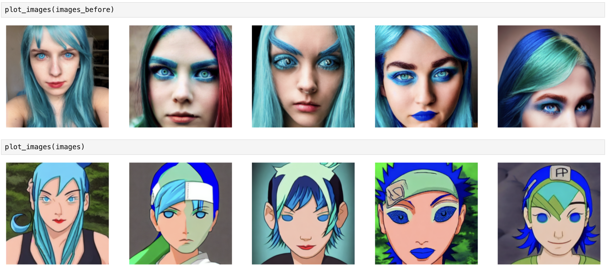
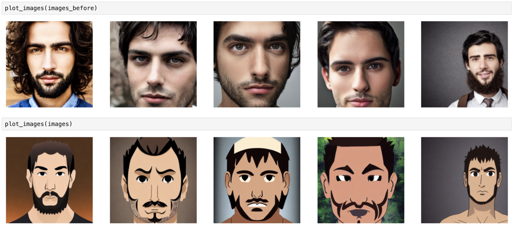

# Custom lora training

Repository contains an MVP service for fine-tuning text-to-image (t2i) models with LoRA on user-provided styles.
The service exposes multiple API endpoints for data upload, training, and inference. Fine-tuning already works even on small datasets (down to single images).

1. MVP service with REST API endpoints.
2. LoRA fine-tuning works on individual images.
3. Inference endpoint generates images using fine-tuned models.
4. Future work outlined in TODO

## How to use
Prepare dataset with folowing structure:
```
.
├── 1.png
├── 2.png
├── 3.png
├── 4.png
├── 5.png
├── 6.png
├── 7.png
├── 8.png
├── 9.png
├── 10.png
└── metadata.jsonl
```
At the same time, metadata.jsonl should look like this:
```
{"file_name": "1.png", "text": "A photo of a cat."}
{"file_name": "2.png", "text": "A dog playing in a park."}
```
Next step is preparation your config file for train and inference

train.yaml example:

```
pretrained_model_name_or_path: "stable-diffusion-v1-5/stable-diffusion-v1-5"
data_dir: "train_dir2"
all_lora_dir: "lora_dir"
lora_dir: "anime2"
gradient_accumulation_steps: 1
mixed_precision: None
report_to: "tensorboard"
seed: 42
lora_config:
    rank: 16
    lora_alpha: 16
    init_lora_weights: "gaussian"
    target_modules: ["to_k", "to_q", "to_v", "to_out.0"]
optimizer:
    learning_rate: 1e-04
    adam_beta1: 0.9
    adam_beta2: 0.999
    adam_weight_decay: 1e-2
    adam_epsilon: 1e-08
image:
    resolution: 512
    center_crop: False
    image_interpolation_mode: "LANCZOS"
train:
    batch_size: 1
    dataloader_num_workers: 1
    lr_warmup_steps: 0
    max_train_steps: 15000
validation_prompt: 'a man with dark hair and brown eyes'
image_column: 'image'
caption_column: 'text'
lr_scheduler: "cosine"
max_grad_norm: 1.0
lr_warmup_steps: 0
max_train_steps: 15000
checkpointing_steps: 500
num_train_epochs: 500
validation_epochs: 1
```

infer.yaml example

```
pretrained_model_name_or_path: "stable-diffusion-v1-5/stable-diffusion-v1-5"
all_lora_dir: "lora_dir"
lora_dir: "anime"
generate_dir: "generate_dir"
apply_lora: True
prompt: 'a man with dark hair and brown eyes'
num_inference_steps: 30
num_img: 5
guidance_scale: 7.5
seed: 42
```
You can load the data using endpoints

## Main API Endpoints

Train LoRA
```
curl -X POST "http://localhost:8080/train"
```

Generate image
```
curl -X POST "http://localhost:8080/generate"
```

List of generated images
```
curl -X GET "http://localhost:8080/generated_images"
```

List of available LoRAs
```
curl -X GET "http://localhost:8080/list_loras"
```

## Storage
Currently, user data (archives, configs, trained models) is stored in temporary local folders.

## Examples:
First raw is generated using classic stabble diffusion v1-5, and the second using lora





## TODO

1. Implement a request queue and ML worker to handle jobs
2. External storage (S3, MinIO, GCS)
3. Multi-user support
4. Monitoring for training and inference (e.g., Prometheus + Grafana)
5. Consider ONNX/TensorRT inference

